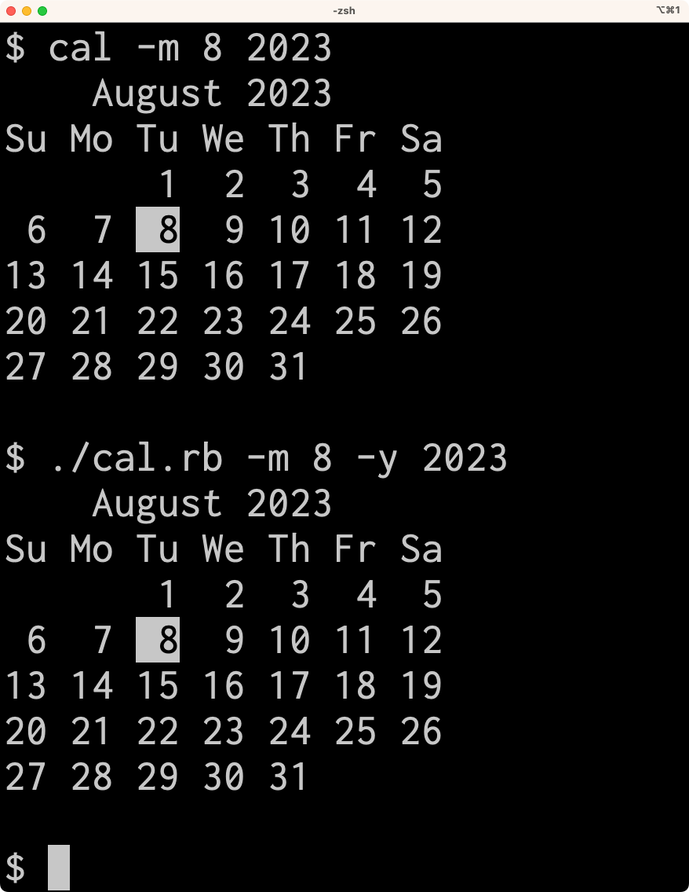
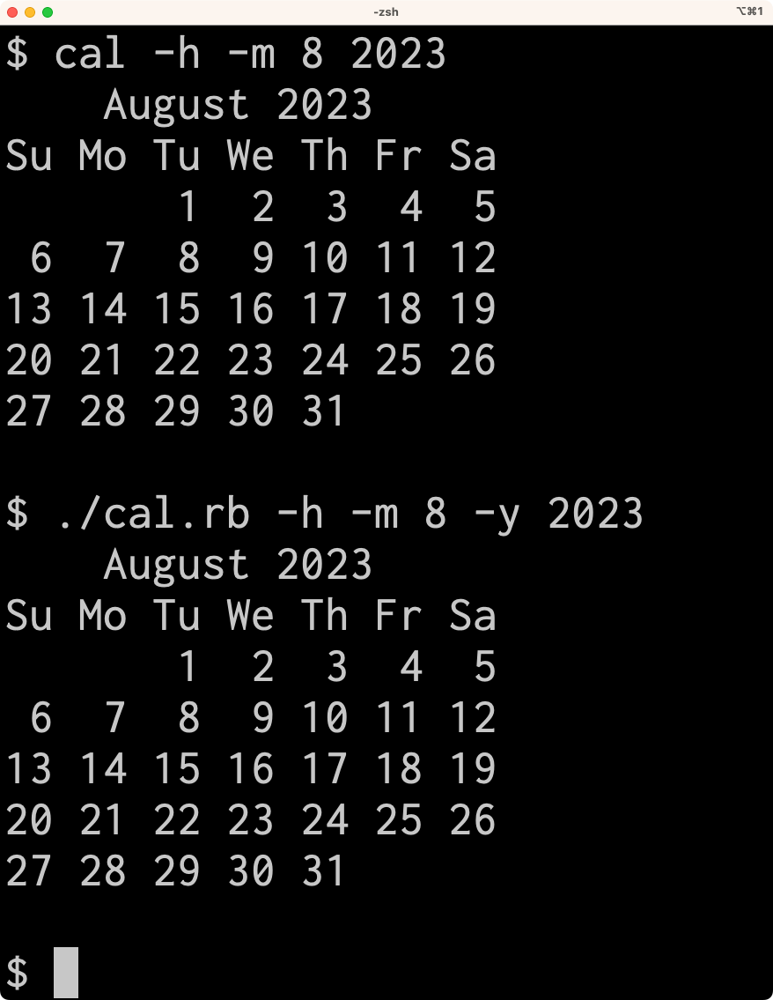

# README

`cal`コマンドの模倣です。

## 使い方

```
$ ./cal.rb --help
  Displays a calendar like the `cal` command.

  Examples
    ./cal.rb                         Display the current month's calendar
    ./cal.rb -m 8                    Display the calendar for current year
    ./cal.rb -m 8 -y 2024            Display the calendar for August 2024

  Options:
    -m, --month MONTH                Display the specified month
    -y, --year YEAR                  Display the specified year
    -h                               Turns off highlighting of today
    -j                               Display Julian days (days one-based, numbered from January 1)
    -N                               Display ncal mode
    -A MONTH                         Display the number of months after the current month
    -B MONTH                         Display the number of months before the current month
    -3                               Display the previous, current and next month surrounding today
```

## サンプル

動作を確認している環境は次のとおりです。

```
$ sw_vers
ProductName:		macOS
ProductVersion:		13.5
BuildVersion:		22G74

# 実行時の年月に関係する機能があるので日付を確かめる
$ date "+%Y-%m-%d"
2023-08-08

$ echo $LANG
en_US.UTF-8
```

### 必須要件

#### 引数を指定しない場合は、今月・今年のカレンダーを表示する

```
$ cal
    August 2023
Su Mo Tu We Th Fr Sa
       1  2  3  4  5
 6  7  8  9 10 11 12
13 14 15 16 17 18 19
20 21 22 23 24 25 26
27 28 29 30 31

$ ./cal.rb
    August 2023
Su Mo Tu We Th Fr Sa
       1  2  3  4  5
 6  7  8  9 10 11 12
13 14 15 16 17 18 19
20 21 22 23 24 25 26
27 28 29 30 31

```

#### `-m`で月を、`-y`で年を指定できる

```
$ cal -m 11
   November 2023
Su Mo Tu We Th Fr Sa
          1  2  3  4
 5  6  7  8  9 10 11
12 13 14 15 16 17 18
19 20 21 22 23 24 25
26 27 28 29 30

$ ./cal.rb -m 11
   November 2023
Su Mo Tu We Th Fr Sa
          1  2  3  4
 5  6  7  8  9 10 11
12 13 14 15 16 17 18
19 20 21 22 23 24 25
26 27 28 29 30

```

```
$ cal -m 11 2020
   November 2020
Su Mo Tu We Th Fr Sa
 1  2  3  4  5  6  7
 8  9 10 11 12 13 14
15 16 17 18 19 20 21
22 23 24 25 26 27 28
29 30

$ ./cal.rb -y 2020 -m 11
   November 2020
Su Mo Tu We Th Fr Sa
 1  2  3  4  5  6  7
 8  9 10 11 12 13 14
15 16 17 18 19 20 21
22 23 24 25 26 27 28
29 30

```

### 歓迎要件

#### `-N`: 月曜始まりにした上で転置で表示する(`ncal`モード)

```
$ cal -N
    August 2023
Mo     7 14 21 28
Tu  1  8 15 22 29
We  2  9 16 23 30
Th  3 10 17 24 31
Fr  4 11 18 25
Sa  5 12 19 26
Su  6 13 20 27
$ ./cal.rb -N
    August 2023
Mo     7 14 21 28
Tu  1  8 15 22 29
We  2  9 16 23 30
Th  3 10 17 24 31
Fr  4 11 18 25
Sa  5 12 19 26
Su  6 13 20 27
```

#### `-j`: ユリウス暦で表示する

```
$ cal -j -m 8 -y 2023
        August 2023
 Su  Mo  Tu  We  Th  Fr  Sa
        213 214 215 216 217
218 219 220 221 222 223 224
225 226 227 228 229 230 231
232 233 234 235 236 237 238
239 240 241 242 243

$ ./cal.rb -j -m 8 -y 2023
        August 2023
 Su  Mo  Tu  We  Th  Fr  Sa
        213 214 215 216 217
218 219 220 221 222 223 224
225 226 227 228 229 230 231
232 233 234 235 236 237 238
239 240 241 242 243

```

#### `-A MONTH`: 指定した年月の後の月も表示する

```
$ ./cal.rb -A 3 -m 1 -y 2015
    January 2023         February 2023           March 2023       
Su Mo Tu We Th Fr Sa  Su Mo Tu We Th Fr Sa  Su Mo Tu We Th Fr Sa  
 1  2  3  4  5  6  7            1  2  3  4            1  2  3  4  
 8  9 10 11 12 13 14   5  6  7  8  9 10 11   5  6  7  8  9 10 11  
15 16 17 18 19 20 21  12 13 14 15 16 17 18  12 13 14 15 16 17 18  
22 23 24 25 26 27 28  19 20 21 22 23 24 25  19 20 21 22 23 24 25  
29 30 31              26 27 28              26 27 28 29 30 31     
                                                                  

     April 2023       
Su Mo Tu We Th Fr Sa  
                   1  
 2  3  4  5  6  7  8  
 9 10 11 12 13 14 15  
16 17 18 19 20 21 22  
23 24 25 26 27 28 29  
30                    

```

#### `-B MONTH`: 指定した年月の前の月も表示する

```
$ ./cal.rb -B 3 -m 1 -y 2015
    October 2022         November 2022         December 2022      
Su Mo Tu We Th Fr Sa  Su Mo Tu We Th Fr Sa  Su Mo Tu We Th Fr Sa  
                   1         1  2  3  4  5               1  2  3  
 2  3  4  5  6  7  8   6  7  8  9 10 11 12   4  5  6  7  8  9 10  
 9 10 11 12 13 14 15  13 14 15 16 17 18 19  11 12 13 14 15 16 17  
16 17 18 19 20 21 22  20 21 22 23 24 25 26  18 19 20 21 22 23 24  
23 24 25 26 27 28 29  27 28 29 30           25 26 27 28 29 30 31  
30 31                                                             

    January 2023      
Su Mo Tu We Th Fr Sa  
 1  2  3  4  5  6  7  
 8  9 10 11 12 13 14  
15 16 17 18 19 20 21  
22 23 24 25 26 27 28  
29 30 31              
                      
```

#### `-A`と`-B`を組み合わせることができる

```
$  ./cal.rb -A 2 -B 3 -m 1 2015
    October 2022         November 2022         December 2022      
Su Mo Tu We Th Fr Sa  Su Mo Tu We Th Fr Sa  Su Mo Tu We Th Fr Sa  
                   1         1  2  3  4  5               1  2  3  
 2  3  4  5  6  7  8   6  7  8  9 10 11 12   4  5  6  7  8  9 10  
 9 10 11 12 13 14 15  13 14 15 16 17 18 19  11 12 13 14 15 16 17  
16 17 18 19 20 21 22  20 21 22 23 24 25 26  18 19 20 21 22 23 24  
23 24 25 26 27 28 29  27 28 29 30           25 26 27 28 29 30 31  
30 31                                                             

    January 2023         February 2023           March 2023       
Su Mo Tu We Th Fr Sa  Su Mo Tu We Th Fr Sa  Su Mo Tu We Th Fr Sa  
 1  2  3  4  5  6  7            1  2  3  4            1  2  3  4  
 8  9 10 11 12 13 14   5  6  7  8  9 10 11   5  6  7  8  9 10 11  
15 16 17 18 19 20 21  12 13 14 15 16 17 18  12 13 14 15 16 17 18  
22 23 24 25 26 27 28  19 20 21 22 23 24 25  19 20 21 22 23 24 25  
29 30 31              26 27 28              26 27 28 29 30 31     
                                                                  

```

#### `-3`: 指定した年月の前後1ヶ月も追加で表示する

```
$ ./cal.rb -3 -m 1 2015
   December 2022          January 2023         February 2023
Su Mo Tu We Th Fr Sa  Su Mo Tu We Th Fr Sa  Su Mo Tu We Th Fr Sa
             1  2  3   1  2  3  4  5  6  7            1  2  3  4
 4  5  6  7  8  9 10   8  9 10 11 12 13 14   5  6  7  8  9 10 11
11 12 13 14 15 16 17  15 16 17 18 19 20 21  12 13 14 15 16 17 18
18 19 20 21 22 23 24  22 23 24 25 26 27 28  19 20 21 22 23 24 25
25 26 27 28 29 30 31  29 30 31              26 27 28
```

#### 今日の日付の部分の色が反転する(背景色と文字色が入れ替わる)



#### `-h`: ハイライトをOFFにできる



#### 誤ったoptionを設定した場合にはエラーメッセージを表示する

```
$ ./cal.rb -x
invalid option: -x
  Displays a calendar like the `cal` command.

  Examples
    ./cal.rb                         Display the current month's calendar
    ./cal.rb -m 8                    Display the calendar for current year
    ./cal.rb -m 8 -y 2024            Display the calendar for August 2024

  Options:
    -m, --month MONTH                Display the specified month
    -y, --year YEAR                  Display the specified year
    -h                               Turns off highlighting of today
    -j                               Display Julian days (days one-based, numbered from January 1)
    -N                               Display ncal mode
    -A MONTH                         Display the number of months after the current month
    -B MONTH                         Display the number of months before the current month
    -3                               Display the previous, current and next month surrounding today
```

```
$ ./cal.rb -m 0
0 is not in range (1..12)

$ ./cal.rb -m 13
13 is not in range (1..12)

$ ./cal.rb -y 1969
1969 is not in range (1970..2100)

$ ./cal.rb -y 2101
2101 is not in range (1970..2100)
```

```
$  ./cal.rb -A 0
Argument to -A must be positive

$  ./cal.rb -A -1
Argument to -A must be positive

$  ./cal.rb -B 0
Argument to -B must be positive

$  ./cal.rb -B -1
Argument to -B must be positive

$  ./cal.rb -3 -A 1
-3 together with -A is not supported

$  ./cal.rb -3 -B 1
-3 together with -B is not supported
```

